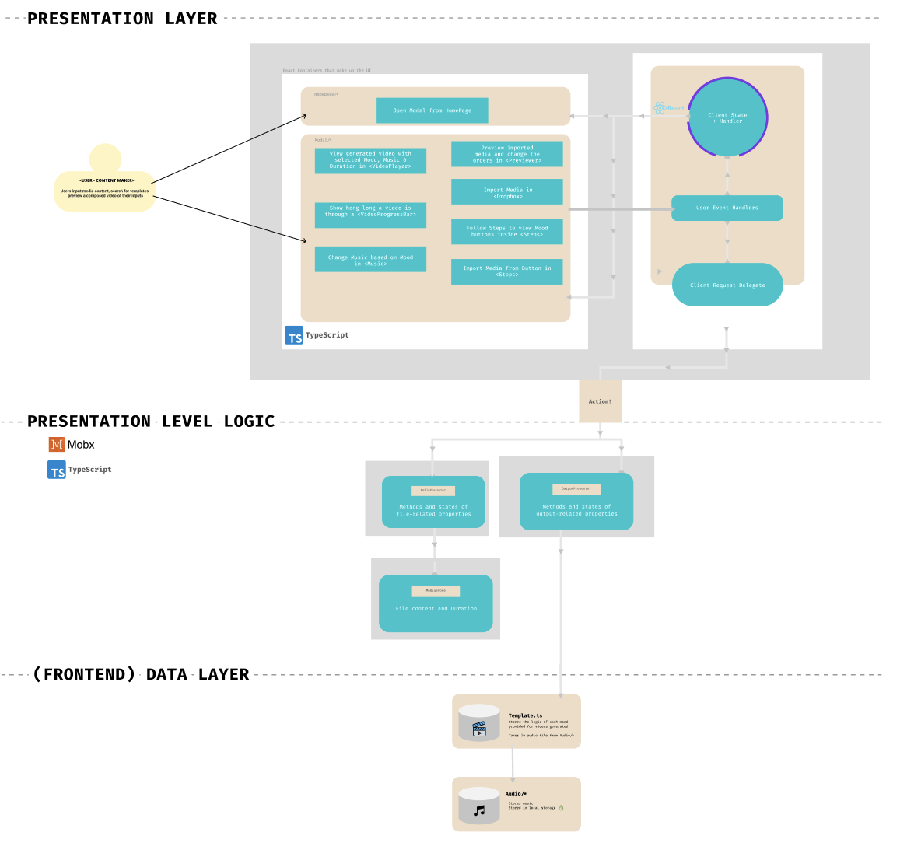

# ✨ Magic Video Auto-Composition ✨

## Project Objective

### Background
Even with Canva’s simple tools, video-making can be a laborious process. Choosing the right template, trimming videos to fit to audio and many more. All add steps and decisions that a user has to go through. Current video templates provide a basic framework, but there is no easy way to try out your own content inside different templates without going through the entire editing process.
There remains a gap between uploading filmed content and downloading a finalised video which presents an opportunity to be solved - a ‘content-first’ approach to video creation

see [here](https://canvadev.atlassian.net/wiki/spaces/INTPROG/pages/1363935799/Magic+video+auto-composition+Video+Experience+Video+-+FE) for inital project plan on Confluence

### Content-First Approach 🎬
Add your available images on your phone, 10-year hard drive and WOLA - a video generated for you!

### Functionality:
- US1: Users must be able to select and upload media content in the form of images and videos 
- US2: Users must also be able to add more media into the application
- US3: Users must be able to to remove media from the application
- US4: The application must generate combined version of the media contents inputted
- US5: Users must be able to view a preview the generated content by the application
- US6: Users must be able to look through a list of available moods and pick the ones which they prefer.  The system must be able to suggest a music category (mood) for each video template generated by users
- US7: Each mood added should also have an associated music.
- US8: Users must be able to edit the title, templates, music and other details of the video
- US9: Users must be able to to use the application across different devices, ie mobile phone, tables and laptop
- US10: User must be able to specify the duration (short or long) of the video generated
- US11: User must be able to set and edit the order of the files


# Building & Running ⛏
## Prerequisites
Yarn installed on your system. If your system does not already have yarn, you can follow the instructions found [here](https://classic.yarnpkg.com/en/docs/install/#mac-stable)

## Frontend
1. Navigate to the folder.
2. Run `yarn install`. This will install all the React dependencies required to run the project. 
3. Run `yarn start`.
At this point, the project should be running at `http://localhost:3000/` in the browser

## Running Tests
Unit tests are written in tests/ folder

`yarn test` launches the test runner in the interactive watch mode.\
See the section about [running tests](https://facebook.github.io/create-react-app/docs/running-tests) for more information.

## Demo Page
Optionally, here is a built web app to view: [here](http://ec2-54-79-73-249.ap-southeast-2.compute.amazonaws.com:3000/)

It's not very responsive for mobile/tablet view, but will work on it after testing is finished!

# Tech Stack

## Languages and Framework


This project is written in TypeScript, bootstrapped with React.

Some states are using React states, however to comply and match with Canva Codebase, we mainly use Mobx for state management.

## Libraries Used / Methods
### Components
- Most Components are written in HTMLElements with stylings
- Modal and Progress Bar are bootstrapped with [React-Bootstrap](https://react-bootstrap.github.io/components/progress/)

### React Player
- Display video files using [React Player](https://www.npmjs.com/package/react-player)

### Drag and Drop: 
- For drag and drop files to dropbox, we used Typescript dragging and dropping events
- For adjusting file index in previewer we used [React-Dnd](https://react-dnd.github.io/)

### Icons
- Most Icons are stored in svg for resizing purposes
- trash / delete Icon is from [Material UI](https://material-ui.com/components/icons/)

### Timer
- You may notice that the videoplayer component requires many state changes, we are using [useInterval](https://usehooks-typescript.com/react-hook/use-interval) to check the states needed to be changed every 100 microsecond

### Layout
- We use flexbox and `<Container>`, `<Row>`, `<Col>` from [React-Bootstrap](https://react-bootstrap.github.io/layout/grid/)


# Code Structure

## Diagram


Now that's a strain on the eyes, so [here](https://www.figma.com/file/xKqDWp1XPyIGOWBVv41qoF/Untitled?node-id=0%3A1)'s the figma file for you to explore.

## Storing Templates/Moods of videos
`Template.ts` contain a list of Mood objects storing mood name, duration, music and the timing of each video generated.

## Output Presenter
`OutputPresenter.ts` takes data from `Template.ts` to generate output for video generated.

Additionally, `OutputPresenter.ts` uses Mobx for state management and contains methods to change the state of video showing / playing such as pause/play video or change music.

An instance of OutputPresenter is created in index.tsx, and passed in as props to components that require its information. This is to ensure only one instance of an OutputPresenter is created and used.

## Media Presenter
`MediaPresenter.ts` contains an list of `MediaStore` which stores the files imported and its associated properties such as durations, file names, played duration stored at.

### Media Store
```
class MediaStore {
  file: File;
  duration: number = 0;
  played: number = 0;
}
```

Additionally, `MediaPresenter.ts` uses Mobx for state management and contains methods to modify file information or `MediaStore[]`

An instance of MediaPresenter is created in index.tsx, and passed in as props to components that require its information. This is to ensure only one instance of an MediaPresenter is created and used.

## Styling
Each component is styled with a css module under componentName.module.css. A generic styling for the project is under `App.css` and `index.css`.
